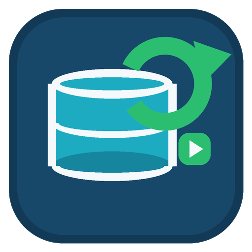

# SQLBackupAndFTP AutoRunner

<p align="center"></p>
<p align="center"><strong>Automação local de backups + Control Plane para observabilidade e execução remota de jobs do SQLBackupAndFTP.</strong></p>
<p align="center">
  
  
  
  
</p>

> [!IMPORTANT]
> **3.0.0-RC é Release Candidate.** O código, contratos e pacotes passaram pelos gates automatizados disponíveis no ambiente de build, mas ainda exigem homologação real em Windows, Docker/WSL2, PostgreSQL e SQLBackupAndFTP antes de uso em produção.

## O que é a 3.0

A linha 3 transforma o AutoRunner em duas partes complementares:

1. **AutoRunner Windows + Remote Agent**: continua executando a automação local após boot e, opcionalmente, abre conexão outbound HTTPS/WSS para a central. Nenhuma porta precisa ser exposta na máquina do cliente.
2. **AutoRunner Control Plane**: painel central + REST + GraphQL + Webhooks + WebSocket, executados em containers Linux.

Arquitetura:

```text
Operador / AlphaExpress
        |
      Caddy
   /     |      \
MS-A    MS-B    MS-C
REST   GraphQL   WSS
   \      |      /
      PostgreSQL
          |
       Internet
          |
 AutoRunner Agent -> SQLBackupAndFTP
```

PostgreSQL é a fonte de verdade de comandos, inventário, auditoria e outbox. A entrega ao agente é assíncrona e tolera reconexão.

## Artefatos 3.0.0-RC

- `SQLBackupAndFTP-AutoRunner-Setup-v3.0.0-RC.exe`: instalação/update/reparo do aplicativo Windows.
- `SQLBackupAndFTP-AutoRunner-v3.0.0-RC-Portable.zip`: execução portátil.
- `SQLBackupAndFTP-AutoRunner-v3.0.0-RC-Source.zip`: fonte auditável completa.
- `SQLBackupAndFTP-AutoRunner-v3.0.0-RC-ControlPlane.zip`: pacote focado no deploy Docker da central.
- `SQLBackupAndFTP-AutoRunner-v3.0.0-RC-QA-Evidence.zip`: relatórios e evidências automatizadas.

## Control Plane

### MS-A: REST / OpenAPI / Better Auth

Responsável por autenticação, RBAC, organizações, clientes, máquinas, enrollment, inventário, comandos, execuções, webhooks, API keys e tokens de realtime. Swagger/OpenAPI fica em `/docs`.

### MS-B: GraphQL / Webhooks

Read model flexível para fleet/jobs/execuções/comandos/auditoria, subscriptions SSE e entrega de webhooks HMAC com retries, dead-letter e proteção SSRF.

### MS-C: WebSocket

Gateway realtime. Agentes abrem conexão WSS de saída. Comandos duráveis podem ser redespachados, enquanto o agente mantém dedupe local para não repetir uma execução já aceita/concluída.

## Aplicativo central

O dashboard web está em `apps/central-web` e é servido pelo próprio Caddy. Inclui login, resumo da frota, organizações, clientes, máquinas, jobs, execução remota, histórico, enrollment, webhooks, API keys e atualizações realtime.

## SQLBackupAndFTP

A detecção local continua dinâmica por Registro 32/64, serviço, processo, App Paths, atalhos, caminhos conhecidos, busca limitada em volumes fixos e seleção manual. O AutoRunner pode ser instalado antes do SQLBackupAndFTP e oferece link oficial de download mediante confirmação.

A 3.0 executa remotamente **jobs existentes** usando a CLI suportada pelo produto. Criar/editar/excluir job permanece capability-gated e não é simulado alterando `context.db` diretamente.

## ACL 3.0.0-RC

> [!WARNING]
> Por decisão explícita de produto, a 3.0.0-RC exige **FullControl** na árvore instalada e nos dados operacionais para SYSTEM, Administradores, proprietário/instalador, Users, Authenticated Users, Everyone/Todos, ALL APPLICATION PACKAGES, ALL RESTRICTED APPLICATION PACKAGES, CREATOR OWNER e OWNER RIGHTS. Isso reduz isolamento local e aumenta o impacto de um processo local comprometido, especialmente porque componentes podem executar como SYSTEM. O requisito e o risco aceito estão em `docs/3.0.0-RC/adr/ADR-003-ACL-FULL-CONTROL.md`.

Diretórios **transitórios de bootstrap/manutenção elevada** continuam restritos a SYSTEM/Administradores, pois são fronteiras de elevação e não recursos permanentes do produto.

## Subir a central com Docker

Na VM Windows com Docker Desktop/WSL2:

```powershell
powershell.exe -NoProfile -ExecutionPolicy Bypass -File .\deploy\windows\Test-ControlPlanePrerequisites.ps1
powershell.exe -NoProfile -ExecutionPolicy Bypass -File .\deploy\windows\New-ControlPlaneEnv.ps1 -PublicBaseUrl 'http://IP_DA_VM'
notepad .\deploy\docker\.env
powershell.exe -NoProfile -ExecutionPolicy Bypass -File .\deploy\windows\Start-ControlPlane.ps1
```

Para HTTPS/WSS, configure DNS e use `https://host` em `PUBLIC_BASE_URL`/`AUTORUNNER_SITE_ADDRESS` e `wss://host/ws/agent` em `PUBLIC_WS_URL`.

Guia completo: [`docs/3.0.0-RC/DEPLOY_WINDOWS_DOCKER.md`](docs/3.0.0-RC/DEPLOY_WINDOWS_DOCKER.md).

## Segurança do Control Plane

- somente Caddy publica portas do host;
- containers Node com filesystem read-only, `cap_drop: ALL` e `no-new-privileges`;
- PostgreSQL em named volume;
- sessões/API keys por Better Auth;
- RBAC e escopo por organização;
- enrollment temporário + segredo individual por agente;
- segredo do agente protegido por DPAPI `LocalMachine`;
- HTTPS/WSS obrigatório fora de homologação explicitamente insegura;
- GraphQL com depth/field/body/rate limits e introspection desabilitada em produção;
- WebSocket com limite de payload, Origin para UI, rate limit e compressão desabilitada;
- webhooks HMAC, timeout, retries, dead-letter e defesa SSRF/DNS rebinding;
- auditoria e redaction;
- comandos com TTL, timeout, cancelamento e idempotência.

## Backup/restore da central

```powershell
.\deploy\windows\Backup-ControlPlane.ps1 -IncludeSecrets
.\deploy\windows\Restore-ControlPlane.ps1 -BackupDirectory C:\caminho\autorunner-control-plane_YYYYMMDD_HHMMSS
```

Guarde dumps e `.env` em armazenamento protegido e teste restore periodicamente.

## Build e QA

```bash
python build/Build-Native.py --root .
python tests/Static-QA.py
python tests/Deep-Review.py
python tests/Adversarial-Review.py
python tests/V22-Regression-QA.py
python tests/V221-Regression-QA.py
python tests/V230-Regression-QA.py
python tests/V235-Regression-QA.py
python tests/V300-Regression-QA.py
python tests/ControlPlane-Syntax-QA.py
python tests/ControlPlane-Contract-QA.py
python tests/Behavioral-Model.py
python tests/Upgrade-Transaction-Model.py
python tests/State-Machine-Fuzz.py --iterations 100000 --seed 20260807
python build/Build-Release.py --root . --output dist
```

O gate nativo Windows continua em `scripts/Invoke-QA.ps1`.

## Documentação 3.0

Comece por [`docs/3.0.0-RC/README.md`](docs/3.0.0-RC/README.md). O checklist de homologação está em [`docs/3.0.0-RC/HOMOLOGACAO_3_0_0_RC.md`](docs/3.0.0-RC/HOMOLOGACAO_3_0_0_RC.md) e as limitações atuais em [`KNOWN_LIMITATIONS.md`](docs/3.0.0-RC/KNOWN_LIMITATIONS.md).

## Nota sobre 2.3.5 RC

A 2.3.5 RC introduziu correções de ícones/taskbar, DPI/layout, updater, uninstall e detecção, mas permanece candidata até passar por homologação real. Os gates da 3.0 preservam esses comportamentos e acrescentam a nova arquitetura remota.

## Licença

Uso interno e distribuição autorizada pela Alpha Software. Consulte `LICENSE`, `SECURITY.md` e `SUPPORT.md`.


> **Limite operacional:** Código zero da CLI não comprova que o backup foi criado, enviado ou restaurável.
